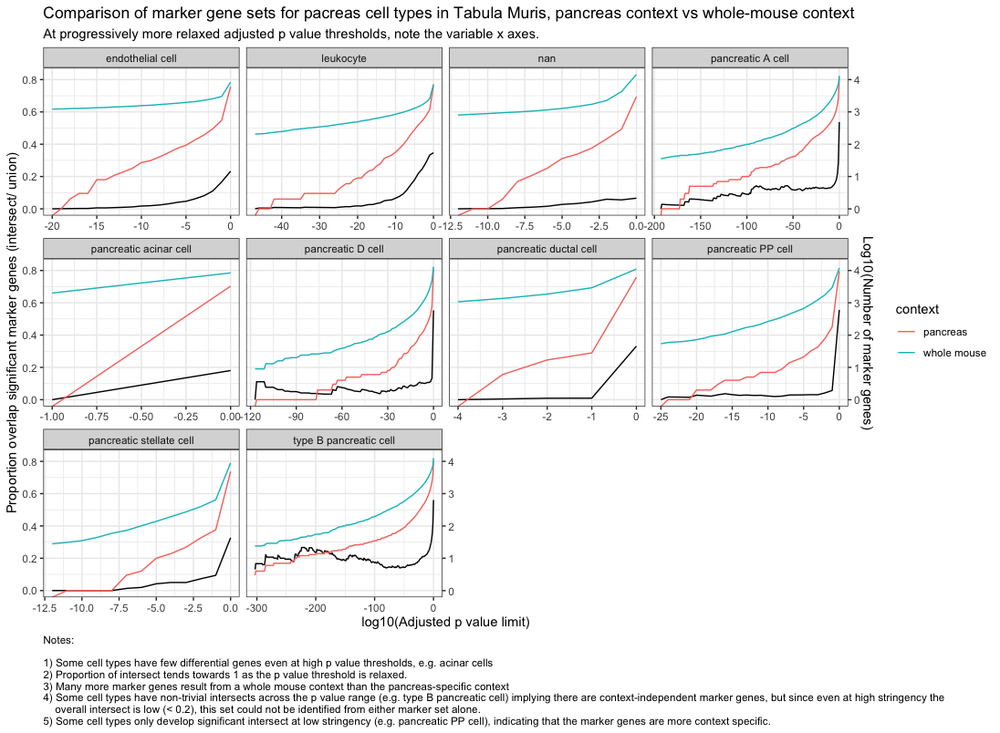

# Markers are defined in specific contexts

When using marker gene sets for downstream inference, it's important to remember that they are usually derived in specific contexts, often wihin an expeirment and against the background of other cell types present there. This means that the marker gene set will be different for example cell type A depending on whether they've been derived for whole organisms, tissues, or cell isolates. 

To illustrate this point, we derived marker gene sets for cell types from the pancreas in Tabula Muris, comparing against a) the rest of the pancreas and b) all other cell types in the mouse (including those from a)). We applied a range of thresholds for adjusted p value and examined the impact this had on the proportion of intersecting genes between the two contexts.

## Results  

The above figure shows how the number of differential (marker) genes and intersecting proportions between contexts evolves as the p value threshold is relaxed. The key points to note are:

 - Some cell types have few differential genes even at high p value thresholds, e.g. acinar cells
 - The Proportion of intersect tends towards 1 as the p value threshold is relaxed
 - Many more marker genes result from a whole mouse context than the pancreas-specific context. This makes sense: we can expect that pancreas cell types are more similar to other pancreas cell types than they are to cells from other organ systems. 
 - Some cell types have non-trivial intersects across the p value range (e.g. type B pancreatic cell) implying there are context-independent marker genes, but since even at high stringency the overall intersect is low (< 0.2), this set could not be identified from either marker set alone.
 - Some cell types only develop significant intersect at low stringency (e.g. pancreatic PP cell), indicating that the marker genes are more context specific. 
